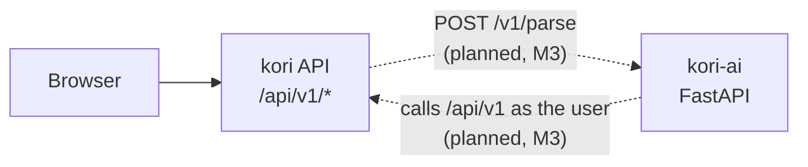

# Architecture

`kori-ai` is the AI service for [Kori](https://github.com/monjurul0007/kori). This document
describes its shape today (stubs only) and where it is heading. Parts marked *(planned)* don't
exist yet. The system-wide picture lives in
[kori's architecture](https://github.com/monjurul0007/kori/blob/main/docs/architecture.md).

## Role

- **Kori owns the financial data.** This service never reads or writes Kori's database.
- **The AI is only a client.** It will call Kori's public API as the logged-in user (M3).
- **AI writes are proposals.** The service returns a proposal and the user confirms it in Kori.
  See [ADR-0003](https://github.com/monjurul0007/kori/blob/main/docs/adr/0003-two-repo-split.md).

## Code layout

| Path | Responsibility |
|---|---|
| `main.py` | App factory (`create_app`) |
| `middleware.py` | The one place middleware is registered |
| `routes.py` | The one place routers are registered |
| `health/`, `parse/` | One package per feature, each with its own `router.py` |
| `contracts/` | Pydantic request and response models. Field descriptions are the spec for parsers |
| `ports/` | Protocols such as `ExpenseParser` |
| `adapters/` | Implementations of the ports. `adapters/stub` holds `NotImplementedParser` |
| `common/` | problem+json errors and the request-ID middleware |

`parse/router.py` exposes `get_parser()`, a FastAPI dependency. Tests replace it with
`app.dependency_overrides[get_parser]`, and M4 swaps in the real parser.

## Endpoints

| Method | Path | Notes |
|---|---|---|
| GET | `/healthz` | `{"status": "ok"}` |
| POST | `/v1/parse` | `ParseRequest` in, `ParseResult` out. 501 until M4 |

## Cross-cutting conventions

| Concern | Convention |
|---|---|
| Errors | RFC 9457 `application/problem+json`, always with `request_id` |
| Money | Decimal strings in taka, at most 2 decimals ([ADR-0004](https://github.com/monjurul0007/kori/blob/main/docs/adr/0004-money-and-dates.md)) |
| Dates | `occurred_on` is a local date in the request's `timezone` (default Asia/Dhaka) |
| Logs | Structured JSON with a request ID |

## Decision records

See [docs/adr](adr/README.md).
